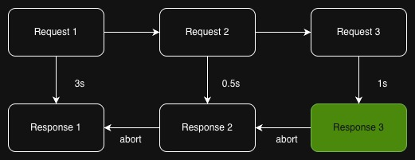
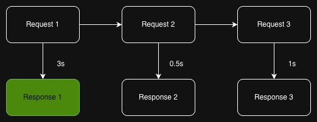

## JS的AbortController class有什麼用？

想像一種情況，用戶瘋狂點擊button發出一堆API requests，結果舊的請求比新的還晚回來，頁面顯示的竟然是過期資料（圖一，最終顯示的是Response 1 ❌）。




AbortController 是 JavaScript 原生提供的一個類別，專門用來**取消異步操作**，最常見的就是取消 fetch 請求。把它想像成一個「遙控器」，可以隨時對正在進行的請求喊停。

```jsx
const controller = new AbortController();
fetch('/api’, { signal: controller.signal })
controller.abort();
```

AbortController 確保「只有最後一次請求的結果會被使用」，並abort前一次正在進行的異步請求（圖二，最終顯示的是Response 3 ✅）。



不只是fetch，例如addEventListener、fs.readFile、axios、ky等一些nodejs原生class和很多libraries都支持AbortController的使用。

順帶一提，React的request memoization機制可以通過傳入signal來opt out。當傳入signal時，React會認為這個請求是「獨立管理」的，因此不會對它進行 **memoization。**Developer角度來看，當你想自己控制request的life cycle的時候，React會自己偷偷關掉原有的cache miss cache hit機制。